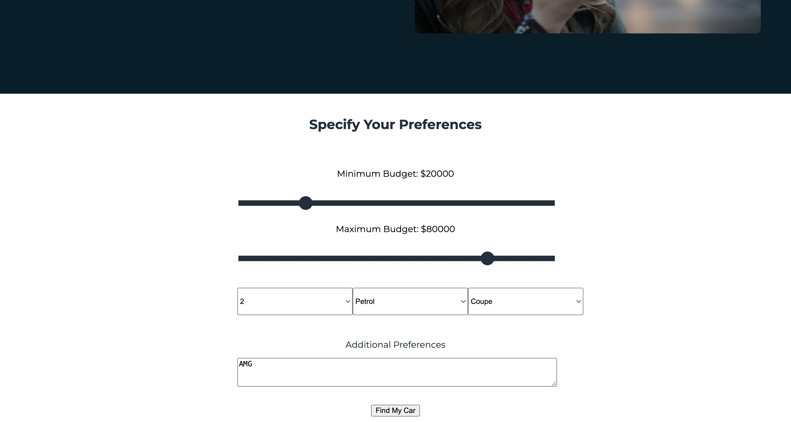
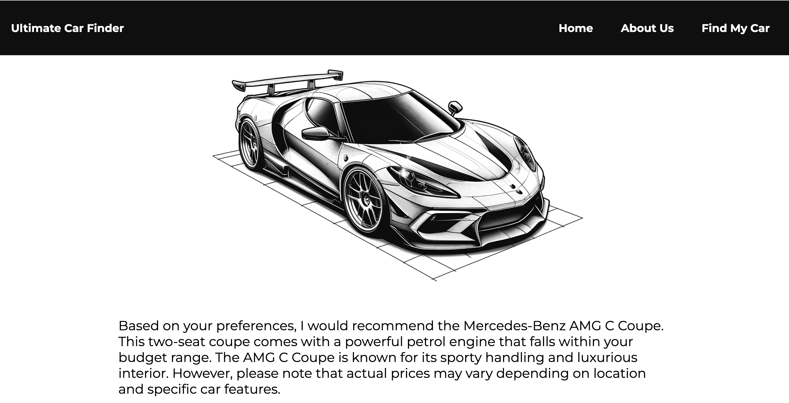
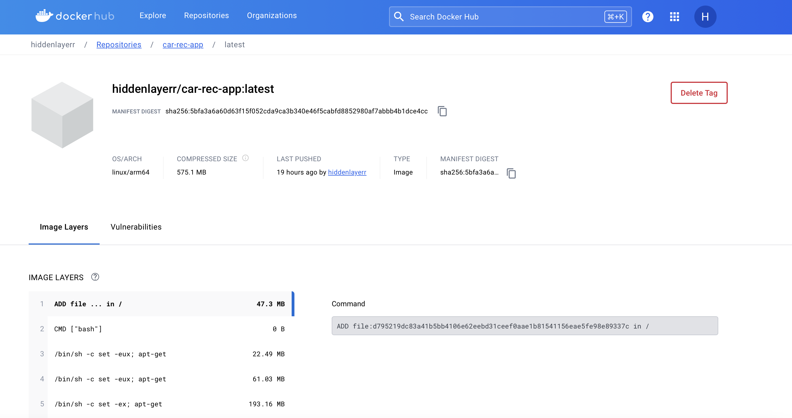
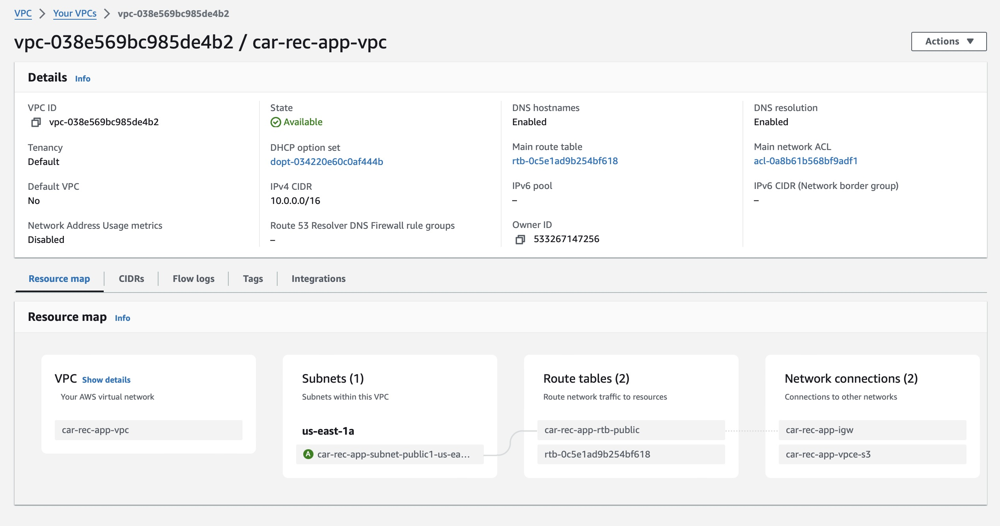
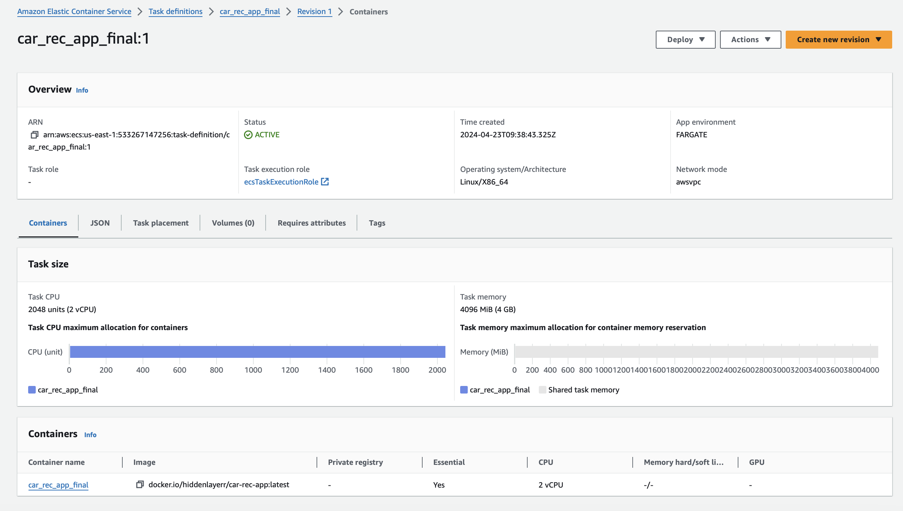
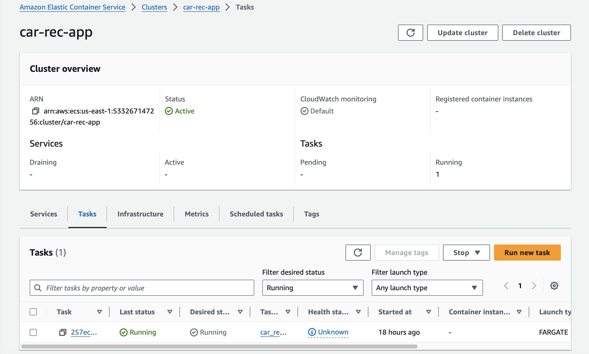
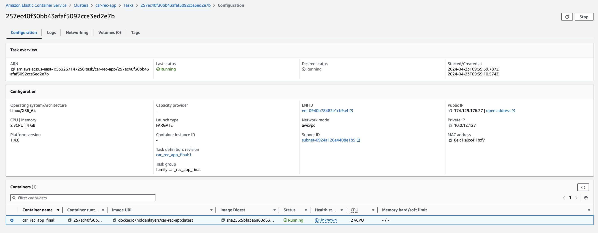
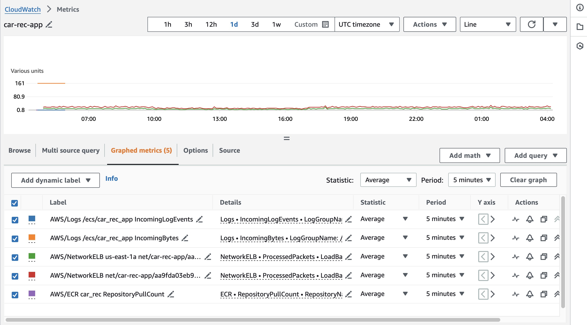

# IDS 721 Final Project
[](https://gitlab.com/jaxonyue/ids-721-final-project/-/commits/main)

## Gitlab Repo Link
Please find the GitLab Repo [here](https://gitlab.com/jaxonyue/ids-721-final-project)

## Team Members
- Tianji Rao
- Haochong Xia
- Jaxon Yue
- Yabei Zeng

## Video
https://youtu.be/X-iEfVWdwio

## Overview
* This is our repository of IDS 721 final project - LLMOps - Model Serving with Rust. In this project, we deployed a Rust web service that can provide car recommendation based on user's preference. It utilizes the `mistralai/mistral-7b-instruct-v0.2` model to perform prediction on what car the user should buy. Meanwhile, it will also provide reasons to explain this choice. After that, we exposed our repo on `VPC` on AWS and then deployed it using `ECS/Fargate`. Finally, we create a CI/CD file to test the pipeline and passed.

## Purpose
- Obtain open source ML model (mistralai/mistral-7b-instruct-v0.2)
- Create Rust web service for model inferences
- Containerize service and deploy to Kubernetes (or any container orchestration, i.e ECS/Fargate, App Runner, etc). For this project, we used ECS/Fargate.
- Implement CI/CD pipeline

## Flow chart


## Link to our web service

http://174.129.176.27:8080

## Home Page of Our Web(Car Recommandation)


## Service Dependencies

```
actix-files = "0.6.5"
actix-web = "4.5.1"
dotenv = "0.15.0"
log = "0.4.21"
reqwest = { version = "0.11", features = ["json"] }
serde = { version = "1.0", features = ["derive"] }
serde_json = "1.0.116"
serde_qs = "0.13.0"
warp = "0.3.7"
openssl = { version = "0.10.35", features = ["vendored"] }
tokio = { version = "1", features = ["macros", "rt-multi-thread"] }

```
## Our Open Source ML Model

- Link to our model: https://huggingface.co/mistralai/mistral-7b-instruct-v0.2

After we got the API token, we call the model using using this api endpoint:
`https://api.replicate.com/v1/models/mistralai/mistral-7b-instruct-v0.2/predictions`

## Rust Web Service
- In our Rust web service, we use the `actix-web` framework to create a web server. We use the `warp` framework to create a web server. We use the `reqwest` framework to send HTTP requests to the model API. We use the `serde` and `serde_json` frameworks to serialize and deserialize JSON data. We use the `dotenv` framework to load environment variables from a `.env` file. We use the `log` framework to log messages. We use the `openssl` framework to enable HTTPS support. We use the `tokio` framework to enable asynchronous I/O.

## How to Use Our Web Service
- After you open the link, you can click `Find Your Car`, then input your preference for the car, including the price, the number of seats, the engine type, the car type, and there is a text box for you to input your custom preference. 



- After you click `Find My Car`, the web service will provide you with the car recommendation and the reasons for this recommendation.



## Docker Image

- We use the 8080 port to expose our service. For details, please refer to the `Dockerfile` in the repository.

- Open the dockerhub and then use the following command in the terminal to build the docker image:
```
docker login
docker build --progress=plain -t test .
```




## Deployment in AWS
1. Create a new VPC in AWS. Select `VPC and more`, name your project, select 1 availability zone, 1 public subnet, 0 private subnet, None for NAT gateway, `S3 Gateway` for VPC endpoint, keep others as default and `Create VPC`.



2. Create a new ECS cluster, name it, select `AWS Fargate` as the infrastructure, and keep others as default.

3. Create a new task, select `Fargate` as the launch type, select task as application type, check the specify of task definition and click the task definition to create a new task definition.

4. Create a new task definition, name it, select `Fargate` as the launch type, select `linux/x86_64` for architecture, select the task size based on your needs to make sure it won't go time out. Select `None` for task role, and `ecsTaskExecutionRole` for task execution role. Click `Add container` to add a new container, name it, and input the image URI and change the port to yours. Finally, click `Create`.



5. At the pop-up window, click `Run Task` under `Deploy`, select `Fargate` as the launch type and select the VPC and subnet you created. Create a new security group, select `custom TCP`, input your port and select `Anywhere` for source. Finally, click `Create`.



6. After finished running the task, click the task, and copy the `Public IP` and include your port in the end to access your service.




## CI/CD Pipeline

- Our CI/CD pipeline is implemented using GitLab CI/CD. The pipeline is triggered on every push to the main branch. The pipeline consists one stage, which is enough, that is `build-test`.
- Firstly, we specify the versions of Rust.
- Secondly, we specify that the job will run in an Ubuntu Docker image based on the latest version.
- Thirdly, we update package lists and install necessary dependencies
- Finally, we include all commands under script:
    1. Installs Rust using the rustup script fetched via curl.
    2. Runs Clippy (Rust linter) quietly.
    3. Formats the code using cargo fmt quietly.
    4. Runs tests quietly.
    5. Builds the project using Cargo build in release mode.

## Monitoring and Metrics
- We use the `CloudWatch` service to monitor the performance of our web service. 




## References
1. https://huggingface.co/mistralai/mistral-7b-instruct-v0.2

